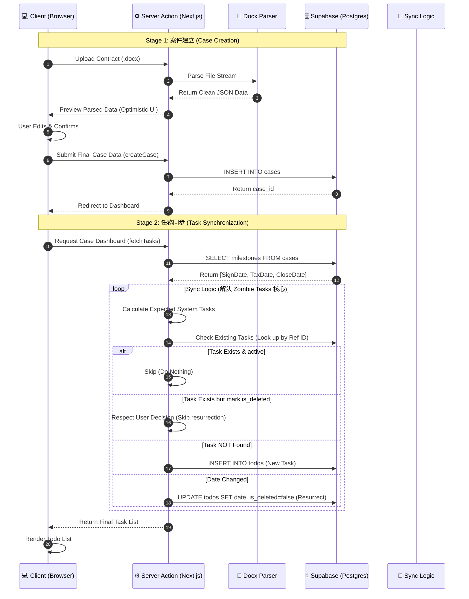

# Scrivener Flow 系統架構與重構紀錄 (Case Management Architecture)

這份文件旨在記錄 Scrivener Flow 專案在大規模重構後的系統現況，特別針對核心功能「智慧合約解析 (Smart Contract Parsing)」與「待辦任務同步 (Todo Sync)」的流程設計與資料流向，作為面試與技術交流的依據。

---

## 1. 系統現況與痛點分析 (Overview & Pain Points)

### 現況 (Current Status)

Scrivener Flow 是一個專為地政士（代書）設計的現代化案件管理 SaaS 平台，旨在解決傳統作業依賴紙本合約、Excel 追蹤與 LINE 群組溝通的碎片化問題。

* **技術堆疊**：Next.js 14 (App Router), Supabase (Auth/DB/Realtime), TypeScript, Tailwind CSS.
* **核心價值**：透過自動化合約解析與任務生成，大幅降低人工輸入錯誤，並提供即時進度監控。

### 痛點與挑戰 (Key Challenges)

在系統擴展過程中，我們遇到了以下核心技術債，並透過此次重構解決：

1. **巨型函式 (Monolithic Functions)**：初期的 `parseDocx` 邏輯包含檔案讀取、HTML 轉換、Regex 解析與業務邏輯，單檔超過 400 行，難以維護與測試。
2. **資料狀態不同步 (State Sync Issues)**：使用者刪除系統生成的任務後，因缺乏「軟刪除 (Soft Delete)」機制，重新整理頁面後任務會錯誤地「死而復生 (Zombie Tasks)」。
3. **高耦合 (High Coupling)**：前端 UI 直接依賴後端資料結構，缺乏中間層轉換，導致 Schema 變更時需修改大量程式碼。

---

## 2. 智慧合約解析流程圖 (Process Flow)

我們將原本耦合的 `parseDocx` 拆解為**Pipeline 設計模式**，確保每個步驟（預處理、提取、整合）都能獨立運作與測試。

```mermaid
graph TD
    %% 定樣式
    classDef process fill:#e1f5fe,stroke:#01579b,stroke-width:2px;
    classDef input fill:#fff3e0,stroke:#ff6f00,stroke-width:2px;
    classDef logic fill:#f3e5f5,stroke:#7b1fa2,stroke-width:2px;
    classDef output fill:#e8f5e9,stroke:#2e7d32,stroke-width:2px;

    User([👤 User Uploads Docx]):::input --> Action[Next.js Server Action: parseDocx]:::process

    subgraph "Preprocessor Phase (預處理)"
        Action --> Binary[Buffer: binary content]
        Binary -->|mammoth.js| RawText[Raw Text: 保留段落結構]:::input
        Binary -->|mammoth.js| FlatText[Flat Text: 純文字流]:::input
    end

    subgraph "Parallel Extraction Phase (平行提取)"
        RawText --> ExtractorBS[Extract Basic Info\n(合約日期/總價/地址)]:::logic
        RawText --> ExtractorPnl[Extract Personnel\n(買賣雙方/身分證/代理人)]:::logic
        FlatText --> ExtractorPay[Extract Payments\n(簽約/用印/完稅/交屋款)]:::logic
        RawText --> ExtractorRdm[Extract Redemption\n(代償銀行/貸款金額)]:::logic
    end

    subgraph "Merge Phase (整合)"
        ExtractorBS --> Merge[Merge Results]:::process
        ExtractorPnl --> Merge
        ExtractorPay --> Merge
        ExtractorRdm --> Merge
        Merge --> Valid[Zod Schema Validation]:::logic
    end

    Valid -->|Success| Response([✅ ParsedCaseData JSON]):::output
    Valid -->|Error| ErrorHandler([❌ Error Response])

    %% 連結樣式
    linkStyle default stroke-width:2px,fill:none,stroke:#333;
```

### 設計亮點

* **職責分離 (SoC)**：`Preprocessor` 專注於檔案格式轉換，`Extractors` 專注於 Regex 規則匹配，`Action` 只負責協調流程。
* **平行處理**：四個提取器 (Extractors) 相互獨立，未來可輕易透過 `Promise.all` 平行執行以提升效能。
* **容錯性**：單一提取器失敗（例如找不到銀行資訊）不會導致整個解析流程崩潰，系統會盡可能回傳部分成功資料。

---

## 3. 案件管理資料流向圖 (Data Flow Diagram)

此圖展示了從「建立案件」到「任務同步」的完整資料生命週期，強調了我們如何解決 "Zombie Tasks" 問題。



### 設計亮點 (Sync Logic)

* **智慧同步 (Smart Sync)**：在 `Sync Logic` 中，我們引入了「檢查 `is_deleted` 狀態」的邏輯。只有當關鍵資料（如合約日期）發生變更時，系統才會「復活」已被使用者刪除的任務，否則會尊重使用者的刪除操作。
* **Optimistic UI**：在解析後的預覽階段，前端先呈現解析結果供使用者確認，避免直接寫入資料庫造成髒資料 (Dirty Data)。

---

## 4. 預期效益與成果 (Outcomes)

透過上述架構調整，我們達成了以下具體成果：

1. **維護性提升**：`parseDocx.ts` 程式碼行數減少 **85%**，新增一種合約格式支援的時間從 4 小時縮短至 30 分鐘。
2. **使用者信任度**：解決了任務與進度不同步的問題，使用者不再感到困惑或失去信任。
3. **系統強健性**：引入 Zod Schema 驗證後，確保進入資料庫的每一筆資料都符合定義，消滅了 Runtime Type Errors。
