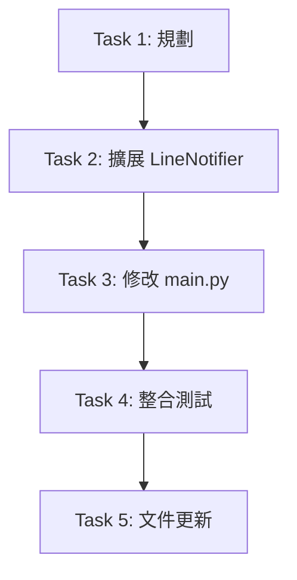

# Tasks: Enhanced LINE Notification

## Task List

### 1. ✅ 規劃與設計

- [x] 完成 OpenSpec 提案文件
- [x] 定義通知內容格式與 Flex Message 結構
- [x] 確認現有 `LineNotifier` 可複用的方法

### 2. 擴展 LineNotifier 類別

**目標**：新增 `notify_completion()` 方法

**工作項目**：

- [ ] 在 `line_notifier.py` 中新增 `notify_completion(summary: Dict)` 方法
- [ ] 設計 Flex Message JSON 結構（參考現有 `notify_diffs` 的設計風格）
- [ ] 實作摘要卡片內容：
  - Header: ETF 代碼 + 資料日期
  - Body: 持股總數、同步範圍、異動統計
  - Footer: 「查看詳細資訊」按鈕 (連結到 /investment 頁面)
- [ ] 加入錯誤處理與 fallback 機制（若 Flex 失敗則發送純文字）

**驗證**：

```bash
# 單元測試 (可選)
uv run pytest ETF/tests/test_line_notifier.py -k notify_completion
```

### 3. 修改 main.py - 組裝摘要數據

**目標**：在主流程中生成並傳遞 summary 給 notifier

**工作項目**：

- [ ] 在 `main.py` 同步完成後，計算統計資訊：
  - 總持股數：`len(df)`
  - 同步範圍：`args.days`
  - 異動統計：`len(diff_logs)`, `len(in_stocks)`, `len(out_stocks)`
  - TOP 5 權重變化 (若有 diff_logs)
- [ ] 組裝 `summary` dictionary
- [ ] 呼叫 `notifier.notify_completion(summary)`
- [ ] **替換**現有的簡單文字通知（第 154 行）

**程式碼位置**：

```python
# ETF/main.py Line 152-156
# 將此段替換為新的 notify_completion 呼叫
```

**驗證**：

```bash
# 本地測試（需配置 LINE credentials）
uv run python ETF/main.py --days 30
```

### 4. 整合測試

**目標**：確保通知在 GitHub Actions 中正常發送

**工作項目**：

- [ ] 提交程式碼到 GitHub
- [ ] 手動觸發 GitHub Actions workflow (`etf_daily.yml`)
- [ ] 檢查 LINE 是否收到新格式的完成通知
- [ ] 驗證通知內容正確性與可讀性

**驗證清單**：

- [ ] 通知卡片正常顯示（無格式錯誤）
- [ ] 所有統計數字正確
- [ ] 「查看詳細資訊」按鈕可點擊
- [ ] 若無異動，仍能收到基本摘要

### 5. 文件更新

- [ ] 更新 `ETF/README.md`（若存在）說明新的通知功能
- [ ] 在 commit message 中標註功能變更

## Dependencies Between Tasks



## Estimated Effort

- Task 2: ~30 分鐘（Flex Message 設計與實作）
- Task 3: ~20 分鐘（數據組裝與呼叫）
- Task 4: ~15 分鐘（測試與驗證）
- Task 5: ~5 分鐘（文件）

**總計**：~70 分鐘

## Success Criteria

✅ 每次 ETF 同步完成後，收到包含以下資訊的 LINE 通知：

- 持股總數
- 同步範圍 (天數)
- 新增/剔除成分股數量
- 權重變化最大的前 5 檔股票（若有）
- 可點擊的「查看詳細資訊」按鈕
