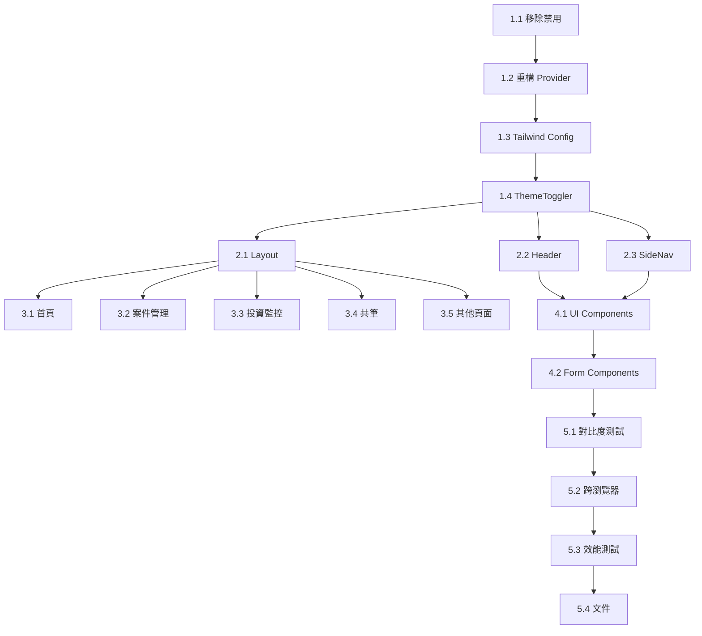

# Tasks: Global Dark Mode (Full Site)

## 🎯 專案範圍更新

**重大變更**：從「投資頁面」擴大到「全站深色模式」

**現狀發現**：

- `ThemeProvider` 已存在但被鎖定為 `light` mode
- `globals.css` 有明確禁用深色模式的程式碼
- 多數元件已有 `dark:` variants（表示曾規劃過）

**策略**：移除禁用設定 → 重構 ThemeProvider → 逐頁啟用深色支援

---

## Phase 1: 基礎設施重構 (Core Infrastructure)

### 1.1 ✅ 移除深色模式禁用設定

**目標**：清理 globals.css 中的強制淺色設定

**工作項目**：

- [ ] 刪除 `globals.css` 第 3-17 行的深色模式禁用程式碼

  ```css
  /* 移除這些 */
  :root {
      color-scheme: light only;
  }

  html {
      color-scheme: light;
  }

  @media (prefers-color-scheme: dark) {
      :root {
          color-scheme: light only;
      }
  }
  ```

**驗證**：

```bash
# 檢查 CSS，確認已移除
cat src/app/globals.css | head -n 20
```

---

### 1.2 🔧 重構 ThemeProvider

**目標**：實作真正的主題切換邏輯（取代現有的 no-op 版本）

**工作項目**：

- [ ] 修改 `src/components/providers/ThemeProvider.tsx`
  - 移除 `useState` 的 `'light'` 鎖定
  - 實作從 localStorage 讀取初始主題
  - 實作 `toggleTheme()` 真正的切換邏輯
  - 動態更新 `<html class="dark">` 或移除 class

**程式碼範例**（完整版）：

```typescript
'use client';

import React, { createContext, useContext, useEffect, useState } from 'react';

type Theme = 'light' | 'dark';

interface ThemeContextType {
    theme: Theme;
    toggleTheme: () => void;
    setTheme: (theme: Theme) => void;
}

const ThemeContext = createContext<ThemeContextType | undefined>(undefined);

export function ThemeProvider({ children }: { children: React.ReactNode }) {
    const [theme, setThemeState] = useState<Theme>('light');
    const [mounted, setMounted] = useState(false);

    // 初始化：從 localStorage 讀取
    useEffect(() => {
        setMounted(true);
        const stored = localStorage.getItem('theme') as Theme | null;
        if (stored && (stored === 'light' || stored === 'dark')) {
            setThemeState(stored);
            applyTheme(stored);
        } else {
            // 預設淺色
            applyTheme('light');
        }
    }, []);

    const applyTheme = (newTheme: Theme) => {
        if (newTheme === 'dark') {
            document.documentElement.classList.add('dark');
            document.documentElement.setAttribute('data-theme', 'dark');
        } else {
            document.documentElement.classList.remove('dark');
            document.documentElement.setAttribute('data-theme', 'light');
        }
    };

    const setTheme = (newTheme: Theme) => {
        setThemeState(newTheme);
        localStorage.setItem('theme', newTheme);
        applyTheme(newTheme);
    };

    const toggleTheme = () => {
        const newTheme = theme === 'light' ? 'dark' : 'light';
        setTheme(newTheme);
    };

    // 避免 hydration mismatch
    if (!mounted) {
        return <>{children}</>;
    }

    return <ThemeContext.Provider value={{ theme, toggleTheme, setTheme }}>{children}</ThemeContext.Provider>;
}

export function useTheme() {
    const context = useContext(ThemeContext);
    if (!context) throw new Error('useTheme must be used within ThemeProvider');
    return context;
}
```

**驗證**：

- [ ] 在任意元件中呼叫 `useTheme()` 能正確取得 theme state
- [ ] `toggleTheme()` 能切換 `<html class="dark">`
- [ ] localStorage 正確儲存 & 讀取

---

### 1.3 🎨 擴展 Tailwind 配色（Dark Mode Tokens）

**目標**：在 `tailwind.config.ts` 中定義全站深色配色

**工作項目**：

- [ ] 修改 `tailwind.config.ts`

  ```typescript
  {
    darkMode: 'class', // 使用 class 策略
    theme: {
      extend: {
        colors: {
          // Fintech Dark Mode Palette
          dark: {
            bg: '#0F172A',           // Slate 950
            'bg-secondary': '#1E293B', // Slate 900
            'bg-tertiary': '#334155',  // Slate 700
            text: '#F8FAFC',          // Slate 50
            'text-muted': '#94A3B8',  // Slate 400
            border: '#334155',        // Slate 700
            primary: '#F59E0B',       // Amber 500
            secondary: '#FBBF24',     // Amber 400
            cta: '#8B5CF6',           // Violet 500
            positive: '#10B981',      // Emerald 500
            negative: '#EF4444',      // Red 500
          }
        }
      }
    }
  }
  ```

**驗證**：

```bash
# 確認 Tailwind 配置生效
yarn build
```

---

### 1.4 🌓 建立 ThemeToggler Component

**目標**：實作全局主題切換按鈕

**工作項目**：

- [ ] 建立 `src/components/ui/ThemeToggler.tsx`
  - 使用 `lucide-react` 的 `Sun` 和 `Moon` icon
  - 平滑 transition (200ms)
  - Keyboard 支援 (Enter/Space)

**程式碼範例**：

```typescript
'use client';

import { Sun, Moon } from 'lucide-react';
import { useTheme } from '@/components/providers/ThemeProvider';

export function ThemeToggler() {
    const { theme, toggleTheme } = useTheme();

    return (
        <button
            onClick={toggleTheme}
            onKeyDown={(e) => {
                if (e.key === 'Enter' || e.key === ' ') {
                    e.preventDefault();
                    toggleTheme();
                }
            }}
            aria-label={theme === 'dark' ? '切換至淺色模式' : '切換至深色模式'}
            aria-pressed={theme === 'dark'}
            className="p-2.5 rounded-full bg-slate-100 dark:bg-slate-800 hover:bg-slate-200 dark:hover:bg-slate-700 transition-all duration-200 cursor-pointer focus:ring-2 focus:ring-dark-primary focus:ring-offset-2"
        >
            {theme === 'dark' ? (
                <Sun className="w-5 h-5 text-amber-500" />
            ) : (
                <Moon className="w-5 h-5 text-slate-600" />
            )}
        </button>
    );
}
```

- [ ] 將 ThemeToggler 放入 Header 的右側區域

  ```tsx
  // src/components/layout/Header.tsx
  import { ThemeToggler } from '@/components/ui/ThemeToggler';

  // 在 Header 的右側，「新增案件」按鈕之前加入
  <ThemeToggler />
  ```

**驗證**：

- [ ] 點擊切換器能成功切換主題
- [ ] Icon 平滑過渡
- [ ] Keyboard 操作正常

---

## Phase 2: 全站佈局元件適配 (Global Layout)

### 2.1 📐 Layout Root (layout.tsx)

**目標**：確保主佈局支援深色模式

**工作項目**：

- [ ] 更新 `src/app/layout.tsx` 第 32 行

  ```tsx
  // 原本
  <div className="min-h-screen bg-slate-50 flex transition-colors duration-500">

  // 改為
  <div className="min-h-screen bg-slate-50 dark:bg-dark-bg flex transition-colors duration-500">
  ```

- [ ] 更新裝飾性背景元素（第 37-41 行）

  ```tsx
  // 原本
  <div className="... bg-blue-500/10 ...">

  // 改為
  <div className="... bg-blue-500/10 dark:bg-violet-500/5 ...">
  ```

- [ ] 更新 Suspense fallback

  ```tsx
  <div className="h-16 w-full animate-pulse bg-slate-100 dark:bg-slate-800" />
  ```

**驗證**：

- [ ] 切換主題後，整體背景正確變色
- [ ] 裝飾性元素在深色模式下可見但不刺眼

---

### 2.2 📌 Header Component

**目標**：Header 完整支援深色模式

**注意**：Header 已有部分 `dark:` variants，只需補全缺漏

**工作項目**：

- [ ] 確認 Header 背景（第 59 行）

  ```tsx
  className="... backdrop-blur-xl border-b border-slate-200/60 dark:border-slate-800/60 ..."
  ```

  ✅ 已有 dark variant，檢查是否正確

- [ ] 確認導航連結 (第 80-89 行)

  ```tsx
  className="... text-slate-600 dark:text-slate-300 hover:bg-slate-100 dark:hover:bg-slate-800 ..."
  ```

  ✅ 已有 dark variant

- [ ] 確認時鐘/天氣小工具 (第 94-121 行)

  ```tsx
  className="... bg-slate-50/50 dark:bg-slate-800/50 border border-slate-100 dark:border-slate-800 ..."
  ```

  ✅ 已有 dark variant

- [ ] 確認搜尋列 (第 125-138 行)

  ```tsx
  className="... bg-slate-100 dark:bg-slate-800/40 border border-slate-200/50 dark:border-slate-700/50 ..."
  ```

  ✅ 已有 dark variant

- [ ] **新增 ThemeToggler**（第 142-151 行之間）

  ```tsx
  <ThemeToggler />
  ```

**驗證**：

- [ ] Header 在深色模式下清晰可讀
- [ ] 所有互動元素 hover 狀態正確

---

### 2.3 📂 SideNav Component

**目標**：側邊導航列支援深色模式

**工作項目**：

- [ ] 檢查 `src/components/layout/SideNav.tsx`
- [ ] 補充缺少的 `dark:` variants
  - Background: `bg-white dark:bg-slate-900`
  - Border: `border-slate-200 dark:border-slate-800`
  - Text: `text-slate-600 dark:text-slate-300`
  - Hover: `hover:bg-slate-100 dark:hover:bg-slate-800`

**驗證**：

- [ ] SideNav 在深色模式下與主內容和諧一致

---

## Phase 3: 全站頁面元件適配 (Pages \u0026 Components)

### 3.1 📄 首頁 (Dashboard)

**目標**：`src/app/page.tsx` 深色支援

**工作項目**：

- [ ] 更新 Card 元件

  ```tsx
  className="bg-white dark:bg-dark-bg-secondary border border-slate-200 dark:border-dark-border"
  ```

- [ ] 更新標題文字

  ```tsx
  className="text-slate-900 dark:text-dark-text"
  ```

- [ ] 更新次要文字

  ```tsx
  className="text-slate-500 dark:text-dark-text-muted"
  ```

**驗證**：

- [ ] 首頁在深色模式下清晰可讀

---

### 3.2 📁 案件管理 (/cases)

**目標**：案件列表與詳情頁支援深色模式

**工作項目**：

- [ ] `src/app/cases/page.tsx`
  - Table header: `bg-slate-100 dark:bg-dark-bg-secondary`
  - Table border: `border-slate-200 dark:border-dark-border`
  - Row hover: `hover:bg-slate-50 dark:hover:bg-slate-800/50`
- [ ] `src/app/cases/[id]/page.tsx`
  - Card backgrounds
  - Form inputs: `bg-white dark:bg-slate-800`
  - Labels: `text-slate-700 dark:text-slate-300`

**驗證**：

- [ ] 案件列表清晰可讀
- [ ] 表單在深色模式下正確顯示

---

### 3.3 📈 投資監控 (/investment)

**目標**：參考原本的 investment-dark-mode 規格

**工作項目**（參考原 tasks.md Phase 3）：

- [ ] HoldingsTable
- [ ] DiffLedger
- [ ] Charts (RankingTrendChart, ChangeImpactChart, ChipsChart)

**驗證**：

- [ ] 圖表在深色模式下清晰可見
- [ ] Badge 顏色符合 WCAG AAA

---

### 3.4 📚 共筆 (/knowledge)

**目標**：知識庫頁面深色支援

**工作項目**：

- [ ] 文章列表卡片
- [ ] Markdown 內容渲染（已有部分支援，globals.css 第 309-316 行）
- [ ] 編輯器元件

**驗證**：

- [ ] Rich text 內容在深色模式下可讀

---

### 3.5 其他頁面

**目標**：確保全站一致性

**頁面清單**：

- [ ] /banks (銀行資訊)
- [ ] /redemptions (代償資料)
- [ ] /clauses (法規條文)
- [ ] /guidelines (辦案指南)
- [ ] /notes (工作筆記)
- [ ] /calculator (稅費試算)

**統一方法**：

- 套用標準的 dark variants
- 使用定義好的 dark tokens

---

## Phase 4: 共用元件適配 (Shared Components)

### 4.1 📦 UI Components (shadcn/ui)

**目標**：確保 UI 元件庫支援深色模式

**工作項目**：

- [ ] `src/components/ui/card.tsx`

  ```tsx
  className="bg-white dark:bg-dark-bg-secondary border-slate-200 dark:border-dark-border"
  ```

- [ ] `src/components/ui/tabs.tsx`
- [ ] `src/components/ui/badge.tsx`
- [ ] `src/components/ui/button.tsx`

**驗證**：

- [ ] 所有 UI 元件在深色模式下正常顯示

---

### 4.2 🎨 Form Components

**目標**：表單輸入元件深色支援

**工作項目**：

- [ ] Input fields

  ```tsx
  className="bg-slate-50 dark:bg-slate-800 border-slate-200 dark:border-slate-700 text-slate-900 dark:text-white"
  ```

- [ ] Textarea
- [ ] Select
- [ ] Checkbox/Radio

**驗證**：

- [ ] 所有表單元件在深色模式下可正常輸入

---

## Phase 5: 測試與優化 (Testing \u0026 Polish)

### 5.1 🧪 對比度測試

**目標**：確保所有文字符合 WCAG AAA

**工作項目**：

- [ ] 使用 WebAIM Contrast Checker 測試主要文字配色
- [ ] 調整不符合標準的配色

**測試工具**：

- <https://webaim.org/resources/contrastchecker/>

**驗證標準**：

- H1-H3: ≥ 7:1
- Body: ≥ 7:1
- Muted: ≥ 4.5:1

---

### 5.2 🌐 跨瀏覽器測試

**目標**：確保主流瀏覽器一致體驗

**測試項目**：

- [ ] Chrome: 切換與持久化
- [ ] Safari: iOS/macOS
- [ ] Firefox: Quantum 引擎

---

### 5.3 ⚡ 效能測試

**目標**：切換流暢，無卡頓

**工作項目**：

- [ ] Chrome DevTools Performance 錄製
- [ ] 確認 FPS ≥ 60
- [ ] 無 Layout Thrashing

---

### 5.4 📝 文件與提交

**工作項目**：

- [ ] 更新 README (若需要)
- [ ] Git Commit (Conventional Commits)

  ```
  feat(全站): 實作深色模式支援

  - 重構 ThemeProvider 實作真正的主題切換
  - 移除 globals.css 中的深色模式禁用設定
  - 升級全站元件以支援 dark mode
  - 新增 ThemeToggler 元件
  - 採用 Fintech Dark Mode 配色系統
  - 符合 WCAG AAA 對比度標準

  BREAKING CHANGE: 移除強制淺色模式限制

  Closes: investment-dark-mode
  ```

---

## Dependencies Between Tasks



## Estimated Effort

**Phase 1 (Infrastructure)**: ~60 分鐘

- 1.1: 5min
- 1.2: 30min
- 1.3: 10min
- 1.4: 15min

**Phase 2 (Layout)**: ~30 分鐘

- 2.1: 10min
- 2.2: 10min
- 2.3: 10min

**Phase 3 (Pages)**: ~90 分鐘

- 3.1: 15min
- 3.2: 25min
- 3.3: 30min (already well-defined)
- 3.4: 15min
- 3.5: 5min

**Phase 4 (Components)**: ~30 分鐘

- 4.1: 20min
- 4.2: 10min

**Phase 5 (Testing)**: ~30 分鐘

- 5.1: 15min
- 5.2: 5min
- 5.3: 5min
- 5.4: 5min

**總計**：~4 小時（全站）

---

## Success Criteria

✅ 整個 Web 應用完整支援深色/淺色模式切換
✅ ThemeToggler 功能正常，偏好正確持久化
✅ 所有頁面在深色模式下清晰可讀
✅ 所有文字通過 WCAG AAA 對比度測試
✅ 圖表、表格、表單在深色模式下正確顯示
✅ 切換動畫流暢（FPS ≥ 60）
✅ 跨瀏覽器相容無異常
✅ 符合 UI PRO MAX 專業標準
✅ 無 hydration warnings 或 console errors
