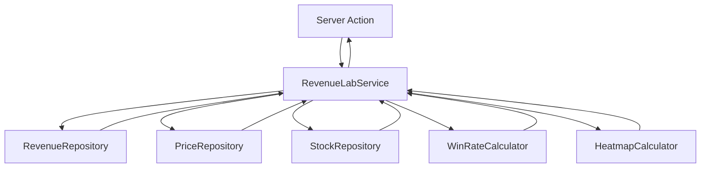

# Design: Refactor Revenue Lab Service

## Context

Current `revenueLabService.ts` is a monolithic file handling data fetching, complex statistical calculations, and data transformation for the Revenue Lab feature. This violates SRP and makes testing difficult. We need to refactor this into a layered architecture.

## Goals / Non-Goals

**Goals:**

- **Layered Architecture**: Separate Data Access (Repositories) from Domain Logic (Calculators).
- **Testability**: Enable unit testing for statistical logic without database dependencies.
- **Maintainability**: Smaller, focused files for easier reading and modification.
- **Type Safety**: strict typing for all data passing between layers.

**Non-Goals:**

- Changing the external API or return types of `fetchWinRateFromDB` and `fetchHeatmapFromDB` (consumers should not be affected).
- Optimizing database queries performance (focus is on code structure, unless obvious wins exist).

## Architecture

### 1. Repositories (Data Access Layer)

Located in `src/repositories/`. Responsible for raw data fetching from Supabase.

- **`RevenueRepository`**: Fetches monthly revenue data.
- **`PriceRepository`**: Fetches stock price data (Open/Close).
- **`StockRepository`**: Fetches stock basic info (Names).

### 2. Domain Calculators (Business Logic Layer)

Located in `src/services/revenueLab/calculators/`. Pure functions responsible for statistical computations.

- **`WinRateCalculator`**:
  - `calculateWinRateBuckets(revenueData, priceData, stockNames, config)`
  - Logic for grouping by burst count, calculating returns, and aggregating stats.
- **`HeatmapCalculator`**:
  - `calculateHeatmapCells(revenueData, priceData)`
  - Logic for classifying return bins, grouping by month/bin, and calculating cell stats.

### 3. Service Orchestrator (Application Layer)

Refactored `src/services/revenueLabService.ts` will:

1. Call Repositories to fetch necessary data.
2. Call Calculators to process data.
3. Return the final `WinRateYearData` or `HeatmapYearData`.

## Detailed Design

### File Structure

```
src/
  repositories/
    revenueRepo.ts
    priceRepo.ts
    stockRepo.ts
  services/
    revenueLab/
      calculators/
        winRateCalculator.ts
        heatmapCalculator.ts
      index.ts          <-- Replaces original revenueLabService.ts
```

### Data Flow



## Decisions

### 1. Pure Functions for Calculators

Calculators will be pure functions receiving data arrays. This allows us to write unit tests like `expect(calc(mockData)).toEqual(expectedResult)` without checking DB states.

### 2. Repository Pattern

We will introduce a lightweight repository pattern. To avoid over-engineering, these will be simple async functions rather than classes, unless state management is needed (unlikely for this read-only service).

### 3. Incremental Refactoring

The public API of `src/services/revenueLabService.ts` will remain unchanged to support existing Server Actions. We will replace the internal implementation.

## Risks / Trade-offs

- **Risk**: Moving files might break imports if not careful.
  - *Mitigation*: We will keep `src/services/revenueLabService.ts` as the entry point, re-exporting or implementing the main logic there.
- **Trade-off**: More files to manage.
  - *Mitigation*: Better organization and testability outweigh the cost of file count.
